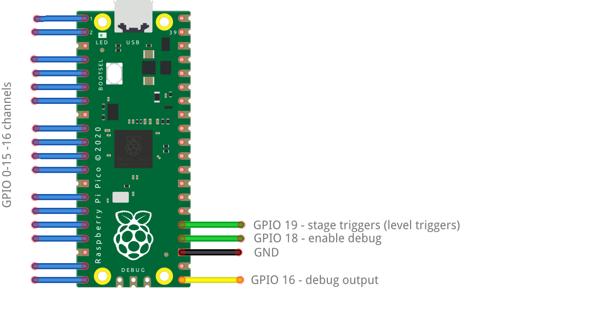
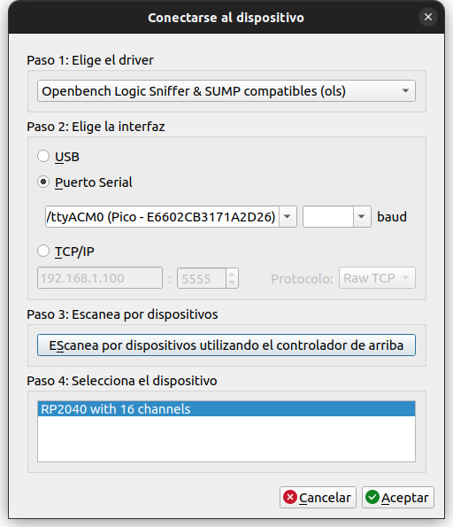
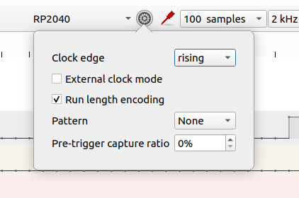

# Logic Analyzer RP2040-SUMP

A 16-channel logic analyzer for RP2040 that implements the [extended SUMP](http://dangerousprototypes.com/docs/The_Logic_Sniffer%27s_extended_SUMP_protocol) protocol.

## Specifications

- 16 channels
- 200 MHz sample rate
- 100K samples
- 1K pre-trigger samples
- Level and edge triggers
- Up to 4 triggers in a single stage
- RLE support

## Usage

Flash the firmware binary to the RP2040, then connect it to a SUMP-compatible client such as:

- [PulseView](https://github.com/sigrokproject/pulseview) (1)(2)
- [sigrok-cli](https://github.com/sigrokproject/sigrok-cli)
- [Jlac](https://github.com/syntelos/jlac)

(1) `libsigrok` has a [bug](https://github.com/sigrokproject/libsigrok/pull/226) when reading from the device. The maximum sample rate and maximum sample size shown in PulseView are incorrect. See this [fork](https://github.com/dgatf/libsigrok), which fixes the issue.  
(2) The SUMP protocol does not define trigger types, and `libsigrok` sends only first-stage triggers. Use the GPIO boot configuration to select the trigger type for PulseView.

The 16 logic analyzer channels are available on GPIOs 0 to 15.

If enabled, debug output is available on GPIO 16 at 115200 bps.

GPIOs 18 and 19 are used for boot-time configuration. See [Configuration](#configuration).

By default, trigger edge override is enabled. To use level trigger behaviour, see [Configuration](#configuration).

Up to four triggers can be enabled. Any additional triggers are ignored.

The onboard LED blinks at boot and during capture.

 

## Binaries

Binaries are generated automatically by GitHub Actions for both `release` and `development` builds.

Binaries are available in [Releases](https://github.com/dgatf/logic_analyzer_rp2040/releases).

The firmware binary is provided as `logic_analyzer.uf2`.

## Installation

Download `logic_analyzer.uf2` and drag and drop it onto the RP2040 in BOOTSEL mode.

## PulseView

To connect from PulseView:

- Open the *Connect to Device* dialog
- Select *Openbench Logic Sniffer & SUMP compatibles (ols)*
- Select *Serial interface*
- Click *Scan for devices* and accept

 

RLE can be enabled in the *Device Configuration* dialog:

 

## Configuration

GPIOs 18 and 19 are used to configure the device at boot.  
Connect the GPIO to GND at boot time to enable or select the option.

**Trigger type**  
The SUMP protocol has only one trigger type, and PulseView sends only first-stage triggers.  
GPIO 19 to GND: use stage-based triggers (PulseView triggers are interpreted as level triggers).  
If not grounded, all triggers are treated as edge triggers.

**Debug mode**  
GPIO 18 to GND: enable debug mode. Debug output is available on GPIO 16 at 115200 bps.

If neither GPIO is grounded, the default configuration is:

- Trigger edge override: enabled
- Debug mode: disabled

## References

- [SUMP protocol](https://www.sump.org/projects/analyzer/protocol/)
- [Extended SUMP protocol](http://dangerousprototypes.com/docs/The_Logic_Sniffer%27s_extended_SUMP_protocol)
- [Sigrok](https://github.com/sigrokproject)
- [Jlac](https://github.com/syntelos/jlac/tree/master)
- [Pico SDK](https://www.raspberrypi.com/documentation/pico-sdk/)