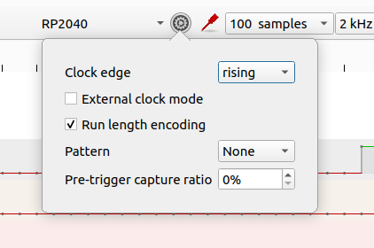

# Logic Analyzer RP2040-SUMP

This is a logic analyzer that implements [extended SUMP](http://dangerousprototypes.com/docs/The_Logic_Sniffer%27s_extended_SUMP_protocol) protocol for RP2040.

## Specifications

- 16 channels
- 200MHz sample rate
- 100K samples
- 1K pre trigger samples
- Level and edge triggers
- Up to 4 triggers (1 stage)
- RLE implemented

## Usage

Upload the [binary](https://drive.google.com/file/d/1JJ5_vQVWJ0RjmcC2NYjNZ1x6iYy9dHWl/view?usp=drive_link).

Connect to a SUMP client:

- [Pulseview](https://github.com/sigrokproject/pulseview)(1)(2).
- [Sigrok-cli](https://github.com/sigrokproject/sigrok-cli)
- [Jlac](https://github.com/syntelos/jlac).

(1) Libsigrok has a [bug](https://github.com/sigrokproject/libsigrok/pull/226) when reading from device. Maximum sample rate and maximum sample size in Pulseview selection lists are incorrect. See [fork](https://github.com/dgatf/libsigrok) which fixes the issue.  
(2) Sump protocol does not have trigger types and libsigrok sends first stage triggers only. Use GPIO config to select trigger type for Pulseview.  

16 channels are available on GPIOs 0 to 15.

If enabled, debug output is on GPIO 16 at 115200bps.

Use GPIOs 18 and 19 to configure the device at boot. See [configuration](#configuration).

Default trigger type is trigger edge. To select trigger level, see [configuration](#configuration).

Four triggers can be enabled. Additional triggers will be ignored.

Led blinks at boot and during the capture process.

   

## Installation

Upload the binary to the RP2040. Drag and drop [logic_analyzer.uf2](https://drive.google.com/file/d/1JJ5_vQVWJ0RjmcC2NYjNZ1x6iYy9dHWl/view?usp=drive_link).

## Pulseview

To connect to Pulseview:

- Open dialog *Connect to device*.
- Select *Openbench Logic Sniffer & SUMP compatibles (ols)*.
- Select *Serial interface*.
- Click on *Scan for devices* and accept.

   

RLE can be enabled in *Device configuration* dialog:

   

## Configuration

GPIOs 18 and 19 are used to configure the device at boot.  
Connect GPIOs to ground to enable/select.    

__Trigger type__  
Sump protocol has one trigger type and Pulseview sends first stage triggers only.  
GPIO 19 to GND: triggers based on stages (triggers from Pulseview are level triggers). If not grounded, all are edge triggers.

__Debug mode__  
GPIO 18 to GND: enable debug mode. Debug output is on GPIO 16 at 115200 bps.

If no GPIO is grounded, the default configuration is:

- Trigger edge override: enabled.
- Debug mode: disabled.

## References

- [Sump protocol](https://www.sump.org/projects/analyzer/protocol/)
- [extended Sump protocol](http://dangerousprototypes.com/docs/The_Logic_Sniffer%27s_extended_SUMP_protocol)
- [Sigrok](https://github.com/sigrokproject)
- [jlac](https://github.com/syntelos/jlac/tree/master)
- [Pico SDK](https://www.raspberrypi.com/documentation/pico-sdk/)
